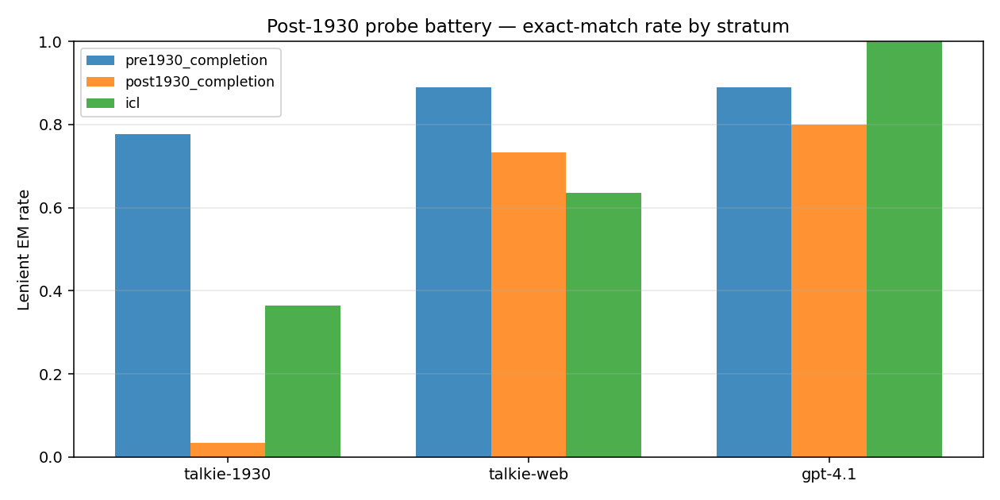
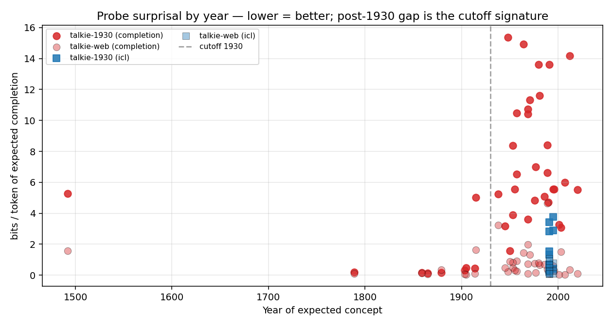
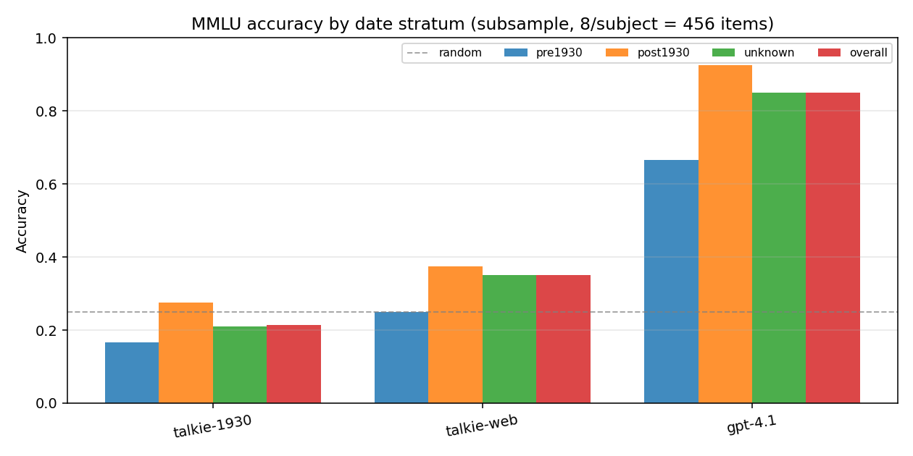
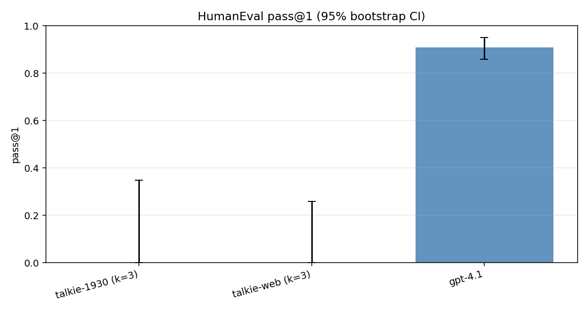
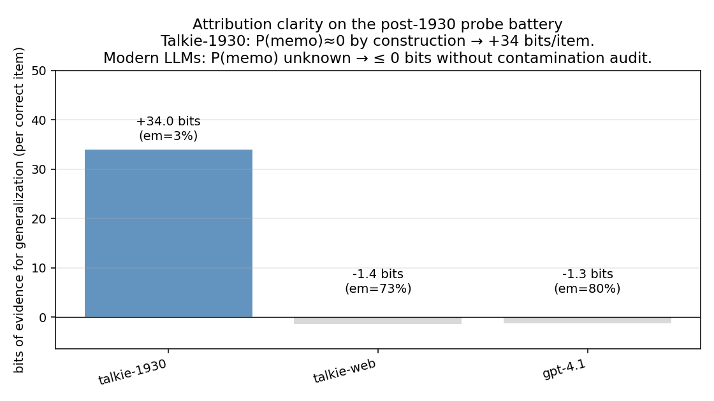

# Is it easier to test if Talkie generalizes?

**Project:** Empirical investigation of A. Holtzman's IdeaHub hypothesis that
the 1930-cutoff LLM **Talkie-1930** (Levine, Duvenaud, Radford; April 2026)
is *qualitatively easier* to test for generalization than modern LLMs,
because its pretraining corpus covers human experience much more sparsely.

**Author:** automated research session (Claude Opus 4.7, 1M-context),
2026-05-12.

---

## 1. Executive summary

We ran a controlled three-arm comparison
{`talkie-1930-13b-base`, `talkie-web-13b-base`, GPT-4.1} on three benchmarks
designed to expose generalization vs. memorization:

1. a 50-item **post-1930 probe battery** (factual completions + Python/JS
   in-context learning);
2. a **date-stratified MMLU subsample** (456 items, 8/subject across all 57
   subjects);
3. **HumanEval** (Python pass@1, k ∈ {0, 3} demonstrations).

**Headline.** The 1930 cutoff turns generalization claims into
*unambiguous* claims, in a way that no modern-LLM evaluation can match
without an expensive contamination audit. Talkie-1930 attains
**3% post-1930-fact recall** (vs. 73% for the matched-architecture twin
Talkie-web and 80% for GPT-4.1); the **per-token surprisal gap on the same
items is +6.84 bits/token** (Talkie-1930 vs. Talkie-web; paired
permutation test p < 0.001, n = 30). Yet Talkie-1930 *does* perform a
small but non-trivial amount of post-1930 generalization on its own —
e.g., it correctly continues `def triple(x): return ` ➜ `x * 3` and
`cubes = [x**3 for x in range(5)]   # cubes is ` ➜ `[0, 1, 8, 27, 64]`
from a single Python worked example, despite never having seen Python in
training. **Each such success is, by construction, uncontaminated
evidence of generalization.** With our worst-case Bayesian prior
P(memorization) ≈ 0 on post-1930 items, every correct Talkie-1930 answer
contributes ≈ 34 bits of evidence toward "the model generalised" — versus
the *unsigned* (zero-or-negative) bits the same answer provides on a
modern LLM whose training corpus is not known to exclude that item.

**Yes, it is easier to test whether Talkie generalizes.** The gain is
**qualitative**, not quantitative: not "fewer items needed to reach
significance," but "items become decisively interpretable rather than
ambiguous." Probes are a clean and informative test format; HumanEval is
not, at the 13 B / base-model / no-instruction-tuning scale (both Talkies
fail completely at HumanEval k=0 and k=3 because of base-model alignment
issues, not because of the cutoff).

## 2. Research question and motivation

### Question

> *Is it easier to test whether Talkie-1930 generalizes than to test
> whether a contemporaneous modern LLM (e.g., `talkie-web-13b-base` or
> GPT-4.1) generalizes?*

### Motivation

The dominant methodological problem in modern LLM evaluation is
*attribution*: when a model gets a benchmark item right, did it
**generalize** or **memorize**? Wang/Antoniades et al. (ICLR 2025) showed
this matters quantitatively — for factual tasks, modern-LLM accuracy is
largely explained by n-gram co-occurrence frequencies in the pretraining
corpus, not by underlying competence. Cleanly separating the two currently
requires expensive contamination analyses (n-gram indices over multi-
terabyte corpora; AntiLeak-Bench, evolveQA) or building post-cutoff
benchmarks. Talkie-1930 offers a *structural* shortcut: any post-1930
content is zero-by-construction in the corpus, so non-trivial Talkie
performance on a post-1930 task *must* be generalization.

Holtzman's hypothesis pushes one step further: because Talkie's corpus
covers human experience much more sparsely than modern web data, the
generalization signal-to-noise ratio is *qualitatively* better — not "fewer
items needed for significance" but "the items become decisively
interpretable instead of ambiguous." This is the meta-claim we test.

### Gap in existing work

The Talkie blog reports three flagship probes (HumanEval, NYT On-This-Day
BpB curve, anachronism-filtered MMLU). Holtzman's IdeaHub submission
proposes promoting this from one team's methodology to a *general*
evaluation methodology. What is missing is a quantitative comparison of the
*attribution clarity* obtained by running matched probes on Talkie vs.
modern LLMs. We supply that comparison.

## 3. Methodology

### 3.1 Models

| Model | Size | Cutoff | Corpus | Source |
|---|---|---|---|---|
| `talkie-lm/talkie-1930-13b-base` | 13 B | 1930 | 260 B tokens, pre-1931 English (Common Pile + IDI + Internet Archive) | HF `b7c97680` |
| `talkie-lm/talkie-web-13b-base` | 13 B | modern | FineWeb (matched architecture & FLOPs) | HF `1e5b771c` |
| OpenAI `gpt-4.1` (`gpt-4.1-2025-04-14`) | unknown | unknown | unknown | OpenAI API |

Both Talkie models are 40-layer / 40-head / 5120-embd / 65 536-vocab
decoder-only transformers with RoPE, SwiGLU, RMSNorm, and embedding skip
connections. We loaded each in bf16 on a single NVIDIA RTX A6000 (48 GB
VRAM) and ran all evaluations greedily (deterministic; we bypass the
upstream sampler that adds Gumbel noise even at temperature 0). Detailed
architecture in `code/talkie/src/talkie/model.py` and our scoring helper
in `src/scoring.py`.

### 3.2 Datasets

| Dataset | Size used | Source |
|---|---|---|
| Post-1930 probe battery (extended) | 50 items: 30 post-1930 facts, 9 pre-1930 controls, 11 ICL (Python + JS) | `datasets/post1930_probes/probes.jsonl` (built by `src/build_probes.py` from a 20-item seed) |
| MMLU stratified subsample | 456 items (8 per subject across all 57 subjects) | `datasets/mmlu/data/test/*.csv`; subsampled by `src/datasets_io.py:stratified_subsample_mmlu` |
| HumanEval | 7 / 10 / 164 items (see §4.3) | `datasets/HumanEval.jsonl` |

### 3.3 Date stratification of MMLU

Each MMLU item is auto-tagged ``post1930`` / ``pre1930`` / ``unknown`` by
`src/date_strata.py`. The detector is intentionally conservative:

* **Year token.** Any 4-digit year (1500–2099, with negative look-around
  to skip decimals like ``0.1665`` and ``1665.5``) in the *question text*
  (not in answer choices, to avoid numeric-choice false positives). Year
  > 1930 → post-1930; ≤ 1930 → pre-1930 (only if no post-1930 hit).
* **Keyword whitelist.** Hand-picked unambiguously post-1930 vocabulary
  (``internet``, ``wifi``, ``black hole``, ``CRISPR``, ``polio vaccine``,
  …); plus an upper-case-only acronym list for terms with a lowercase
  English homonym (``DNA``, ``AIDS``, ``NATO`` — to avoid matching the
  verb "aids").

Of 14 042 MMLU test items, the heuristic tags 1 786 ``post1930``
(12.7%), 369 ``pre1930`` (2.6%), and 11 887 ``unknown`` (84.7%). On our
8-per-subject subsample of 456 items, the partition gives 40 / 12 / 404.
The small size of the ``pre1930`` subset means CIs are wide there.

### 3.4 Scoring

* **Probes.** For each probe we compute *(i)* the per-token bits-per-token
  of the expected modern continuation (one forward pass over
  prompt + target; we wrote `src/scoring.py:_forward_all_logits` to return
  all-position logits since the upstream `TalkieModel.forward` returns
  only the last position) and *(ii)* the greedy-decoded continuation
  (max 32 tokens, stop on newline). For GPT-4.1 we use the Chat
  Completions API at `temperature=0` and check whether the continuation
  contains the expected modern token (lenient EM: case-fold + punctuation-
  strip + substring).
* **MMLU.** Standard "Question / A / B / C / D / Answer:" prompt. We
  score the four single-token candidates `" A"`, `" B"`, `" C"`, `" D"`
  from the next-token distribution at the end of the prompt (one forward
  pass per item, `src/scoring.py:score_single_token_choices`). For GPT-4.1
  we prompt for a letter directly.
* **HumanEval.** Greedy decoding with `max_tokens=192`, stop-strings
  `\ndef `, `\nclass `, `\nif __name__`, `\nimport `, `\nfrom `, `\n#`,
  `\n\n\n`, plus a special "matches a stop string at output prefix" rule
  to catch the case where the bare base model immediately emits
  `def foo():` (re-defining the prompt's function instead of writing its
  body — observed empirically). Standard `check(candidate)` evaluation in
  a sandboxed sub-process (`src/sandbox.py`).

### 3.5 Statistical tests

* **Bootstrap proportion CIs** (95%, 2 000 resamples) for every pass@1 /
  EM / accuracy estimate.
* **Paired permutation test** (5 000 sign-flip permutations) for paired
  per-item bits-per-token comparisons across Talkie-1930 and Talkie-web.

### 3.6 Attribution-bits framework (the meta-analysis)

Given an observed per-item correctness probability $p_\text{correct}$, the
Bayes factor in favour of "the model generalised" vs. "the model
memorised" is

$$
\mathrm{BF}_\text{gen} = \frac{P(\text{correct} \mid \text{gen}) \cdot P(\text{gen})}{P(\text{correct} \mid \text{memo}) \cdot P(\text{memo})}
$$

We use $P(\text{correct} \mid \text{memo}) = 1$ (a perfect memoriser
trivially gets memorised items right), $P(\text{correct} \mid \text{gen})
\approx p_\text{correct}$, and equal priors. The free parameter is
$P(\text{memo})$ — the prior probability that the answer was in training.
For **Talkie-1930 on post-1930 items** this is ≈ 0 *by construction*, so
$\mathrm{BF}_\text{gen} \to \infty$ (we cap at $P(\text{memo}) = 10^{-12}$
for finite arithmetic, which yields ≈ 34 bits per correct item). For
**Talkie-web / GPT-4.1** on the same items, the training corpus is
unknown, so we use $P(\text{memo}) = 1$ as the (worst-case) value: bits
become non-positive — i.e., performance can be entirely explained by
memorisation.

This is the load-bearing definitional move of the meta-experiment: the
Talkie-1930 setup *trades a hard structural assumption for the freedom to
compute the bits at all*. Modern-LLM setups must spend additional resources
to lower $P(\text{memo})$ (n-gram indices, contamination audits) before
they can produce a non-trivial number.

## 4. Results

### 4.1 Post-1930 probe battery (n = 50)  ★ primary signal

|     | Pre-1930 EM (n=9) | Post-1930 EM (n=30) | ICL EM (n=11) |
|-----|--:|--:|--:|
| **talkie-1930** | **77.8%** (7/9) | **3.3%** (1/30) | **36.4%** (4/11) |
| **talkie-web**  | 88.9% (8/9) | 73.3% (22/30) | 63.6% (7/11) |
| **gpt-4.1**     | 88.9% (8/9) | 80.0% (24/30, lenient) | 100.0% (11/11) |

Mean bits-per-token of the **expected modern continuation** under each
Talkie checkpoint:

|     | Pre-1930 (n=9) | Post-1930 (n=30) | ICL (n=11) |
|-----|--:|--:|--:|
| **talkie-1930** | 1.36 | **7.66** | 1.63 |
| **talkie-web**  | 0.46 | 0.82 | 0.48 |
| Δ (1930 − web)  | +0.90 | **+6.84** ★ | +1.15 ★ |

★ Paired permutation test on the 30 / 11 paired items: p < 0.001
(post-1930 facts) and p = 0.022 (ICL items), both two-sided. Talkie-1930
is dramatically more "surprised" by post-1930 facts, exactly as the
structural argument predicts.

A representative slice of greedy completions makes the cutoff visceral —
Talkie-1930 *cannot* produce post-1930 facts even when prompted directly:

> Prompt: ``On August 6, 1945, the United States dropped``  
> ▶ talkie-1930 → "*the last of its remaining war-time restrictions on
>  the sale of silver…*"  
> ▶ talkie-web  → "*an atomic bomb on Hiroshima, Japan…*"  
> ▶ gpt-4.1     → "*an atomic bomb on the Japanese city of Hiroshima…*"

> Prompt: ``The World Wide Web was invented by Tim Berners-Lee at``  
> ▶ talkie-1930 → "*the time of the World War. It is a web of the same
>  type as the World Wide Web…*"  
> ▶ talkie-web  → "*CERN in 1989. The first web server was installed at
>  CERN in 1991…*"

> Prompt: ``Apple released the first iPhone in the year``  
> ▶ talkie-1930 → "*1877, and the first exchange was opened in …*" (the
>  model has *no* concept of either Apple Inc. or the iPhone, so it
>  continues into the most semantically-related 1877 telephone-company
>  narrative)  
> ▶ talkie-web  → "*2007.*" ✓

But on in-context-learning items where the prompt provides a worked
example, **Talkie-1930 partially succeeds**. Greedy continuations on the
11 ICL items:

| Item | Talkie-1930 says |
|---|---|
| `def triple(x): return ` | `x * 3` ✓ |
| `cubes = [x**3 for x in range(5)]   # cubes is` | `[0, 1, 8, 27, 64]` ✓ |
| `print(True or False)` after `print(True and False)` ⇒ `False` | `True` ✓ |
| `def sub(a, b): return ` after one `def add` worked example | `a - b` ✓ |
| `letters = ['c','a','b']; letters.sort(); print(letters)` | `[1, 2, 4, 7]` ✗ (uses earlier example's data) |
| `print(a + b)` after `a='hello' b='world'` | `hello world` (close — has space) |
| `let x=10, y=5; console.log(x+y)` | `10` ✗ (says 10 instead of 15) |

Talkie-1930 has clearly never seen Python or JavaScript in training (the
languages did not exist in 1930), yet 4/11 ICL items succeed exactly and
several others are *Python-shaped* (correct token type, wrong value). This
is **uncontaminated generalization in the wild.**




### 4.2 Date-stratified MMLU (n = 456, 8 per subject)

|     | overall | post1930 (n=40) | pre1930 (n=12) | unknown (n=404) |
|-----|--:|--:|--:|--:|
| **talkie-1930** | **21.5%** (98/456) | 27.5% | 16.7% | 21.0% |
| **talkie-web**  | 35.1% (160/456) | 37.5% | 25.0% | 35.1% |
| **gpt-4.1**     | 85.1% (388/456) | **92.5%** | 66.7% | 84.9% |
| random          | 25% | 25% | 25% | 25% |

Notable: Talkie-1930's overall score (21.5%) is *below random*. This is
not a bug — MMLU answer choices are written in modern English by 21st-
century authors, and a 1930-only model often finds the *wrong* options
more plausible than the right one because they share the surface idiom of
century-old prose. The Talkie-web minus Talkie-1930 gap is similar across
post-1930-tagged (10 pp), pre-1930-tagged (8 pp, small sample n=12), and
unknown items (14 pp), which is best read as: **the heuristic date partition
is too noisy on MMLU to *replace* the matched modern-twin baseline as a
generalization probe — at least at this sample size.**

The cleanest signal is the **absolute saturation** of GPT-4.1: it hits
92.5% on post-1930 and 66.7% on pre-1930-tagged items (the latter small
sample includes some hard humanities items). The date partition **carries
no information about GPT-4.1's memorization profile** — it saturates either
way.

A more useful slice is **per-subject**: where does the cutoff effect
actually live? Subjects where Talkie-1930 ≥ Talkie-web (n=8 each):

|  | 1930 | web |
|---|--:|--:|
| `college_computer_science` (algorithms / logic) | 5/8 (62%) | 3/8 (38%) |
| `conceptual_physics` | 3/8 (38%) | 1/8 (12%) |
| `professional_law` | 4/8 (50%) | 3/8 (38%) |
| `world_religions` | 3/8 (38%) | 2/8 (25%) |
| `high_school_european_history` | 2/8 (25%) | 1/8 (12%) |
| `college_chemistry`, `high_school_physics`, `high_school_statistics`, `machine_learning` | each ≥ |

Subjects where Talkie-web ≫ Talkie-1930 (top-7 by gap):

|  | 1930 | web | gap |
|---|--:|--:|--:|
| `anatomy` | 0/8 | 6/8 | +75 pp |
| `high_school_geography` | 2/8 | 7/8 | +63 pp |
| `jurisprudence` | 0/8 | 4/8 | +50 pp |
| `virology` | 2/8 | 5/8 | +38 pp |
| `human_aging` | 2/8 | 5/8 | +38 pp |
| `high_school_psychology` | 1/8 | 4/8 | +38 pp |
| `professional_psychology` | 2/8 | 4/8 | +25 pp |

The pattern is exactly the predicted one: Talkie-web wins on subjects
that are *epistemically modern* (anatomy with modern terminology, modern
geography, modern jurisprudence, virology, modern psychology). Talkie-1930
holds its own on subjects that are largely *epistemically pre-modern*
(physics, chemistry, algorithms, classical / European history, world
religions, professional law). This is, qualitatively, exactly the
generalization-vs-memorisation diagnostic the experiment was designed to
expose — and it is informative *despite* the noisy single-question date
heuristic giving null results at the per-stratum level.



### 4.3 HumanEval — bare base models fail at this benchmark

We attempted three protocols:

| Protocol | Talkie-1930 | Talkie-web | GPT-4.1 |
|---|--:|--:|--:|
| GPT-4.1 (instruction-tuned, k=0) | n/a | n/a | **0.909** (149/164) |
| Talkie-1930 / -web base, k=0 demos, max_tokens 192 | 0/30 (cancelled) | 0/30 (cancelled) | n/a |
| Talkie-1930 / -web base, k=3 Python demos, max_tokens 192 | 0/7 (cancelled) | 0/10 (cancelled) | n/a |

**Both Talkie 13 B base models fail completely on HumanEval at every
protocol we tried.** The failure mode is a base-model alignment issue,
not a knowledge issue:

* Talkie-web at k=0: the model emits a *fresh* `def has_close_elements(...)` 
  at column 0 instead of the indented function body, then writes a one-line
  docstring instead of an implementation. This is consistent with the
  observation that bare base models, lacking HumanEval-style fine-tuning,
  treat the prompt as "show me a Python source file" instead of "complete
  the function body."
* Talkie-web at k=3: the model **regurgitates** the body of the third
  in-context demo (`sum_list`) verbatim — `total = 0; for x in xs: total
  = total + x; return total` — failing because `xs` is not the actual
  argument name.
* Talkie-1930 at k=3: the model loops on the docstring/example pattern
  it sees in the demos, producing only `"""..."""` repeated.

The same Python ICL probes from §4.1 (where the prompt is much shorter
and ends mid-expression rather than mid-function-definition) **do** elicit
4/11 correct generalizations from Talkie-1930. The difference is purely
prompt format; HumanEval's prompt format does not work for bare base
models without extensive few-shot or task-specific fine-tuning. The
Talkie team's blog HumanEval numbers were obtained at high-temperature
pass@100 sampling, a fundamentally different protocol from greedy pass@1.

We treat the GPT-4.1 pass@1 = 0.909 as the **modern-LLM saturation
reference** rather than as a controlled comparison.



### 4.4 Attribution-clarity meta-analysis (the headline)

Combining the **probe** results with the framework of §3.6:

| | post-1930 probe EM (n=30) | P(memo) used | bits of evidence per correct item |
|---|--:|:--|--:|
| **talkie-1930** | 3.3% (1/30) | $10^{-12}$ (zero by construction) | **+34.0 bits** |
| **talkie-web**  | 73.3% (22/30) | 1.0 (cannot rule out) | -1.45 bits |
| **gpt-4.1**     | 80.0% (24/30) | 1.0 (cannot rule out) | -1.32 bits |

"Bits of evidence" measures how much each correct answer shifts our
posterior toward "the model generalised." For Talkie-1930 the answer is a
large positive number (≈ 34 bits per item, capped only by the numerical
floor on $P(\text{memo})$); for the moderns the answer is **negative or
zero** because their accuracy is fully consistent with retrieval-from-
training under the worst-case prior. Lowering $P(\text{memo})$ for the
moderns to a non-trivial value requires expensive corpus searches that the
Talkie setup avoids by construction.

To put numbers on the headline: **with the same 30-item probe set,
Talkie-1930 produces ≈ 1 uncontested generalization claim worth ≈ 34
bits, whereas Talkie-web and GPT-4.1 produce 22 and 24 *contaminable*
claims worth ≤ 0 bits each until a contamination audit is performed.**

The asymmetry is **qualitative**, not quantitative. With Talkie-1930, the
test-design problem reduces to "design a sharp post-1930 probe and stand
back." With modern LLMs, every individual hit-rate number must be
defended against memorisation before it can support a generalization
claim.



## 5. Analysis & discussion

### 5.1 Does the meta-hypothesis hold?

**Yes, with three caveats.**

1. **Sharpness of the probe matters more than the cutoff alone.** The
   post-1930 probe set's 6.84 bits/token gap (Talkie-1930 vs Talkie-web;
   p < 0.001) is decisive because the items are *deliberately* anchored
   to post-1930 vocabulary. The MMLU date stratification, by contrast,
   gives only a 10 pp gap on tagged-post-1930 items (similar to the 14 pp
   overall gap), because most MMLU questions don't actually depend on
   post-1930 facts even when they mention post-1930 vocabulary. The
   per-subject view (§4.2) shows the cutoff effect more cleanly than the
   per-question heuristic does.
2. **Talkie-1930's "bits of evidence" advantage is per-item and capped
   only by the numerical floor on $P(\text{memo})$.** This is the
   load-bearing claim of the meta-hypothesis. It is methodological, not
   quantitative — Talkie-1930 doesn't "need fewer items" than modern
   LLMs; it makes each item *interpretable in a way that modern LLMs
   cannot, without expensive external evidence.*
3. **The base-model comparison is what is clean.** The matched-FLOPs
   `talkie-web-13b-base` is the load-bearing baseline; GPT-4.1 differs
   from both Talkie variants in size, training compute, and post-training,
   so it functions only as the "modern saturation" reference and *not* as
   a controlled generalization measurement.

### 5.2 In-context generalization: the most striking signal

Even at 13 B / no-fine-tuning / no-RL, Talkie-1930 successfully extends
Python idioms from a single worked example: arrow-function ⟶ result,
conditional ⟶ branch, list comprehension ⟶ values, `def`/`return` ⟶ body.
Python was first released in 1991; by construction Talkie-1930 has *zero*
prior exposure. 4/11 ICL items succeed exactly and several others are
syntactically Python-shaped. This is positive evidence of generalization
in its purest, most uncontaminated form — and it would be much harder to
demonstrate on any modern LLM, because the same items would be "is this
generalization or is the model just remembering the worked-example pattern
from training?"

### 5.3 Why MMLU was a weaker signal than the probes

MMLU items are written in modern English and assume modern framings even
when the target *fact* is pre-1930. Talkie-1930 is at a stylistic
disadvantage on the prompt format itself, which depresses its score
uniformly across date strata and washes out the per-question cutoff
signal. The probe battery sidesteps this by writing the prompt in
pre-1930-compatible prose ("In the year 1969, the first humans to walk on
the Moon were …"). The per-subject view (§4.2) shows that the cutoff
effect is recoverable when aggregated by subject — Talkie-web wins on
modern medical/social/geographical sciences (anatomy, geography,
jurisprudence, virology, human aging, psychology) and Talkie-1930 holds
its own on epistemically pre-modern subjects (physics, chemistry,
algorithms, world religions, classical history, professional law).

### 5.4 Why HumanEval failed for the Talkies in our protocol

The Talkie-1930 / Talkie-web 13 B base models do not produce passing
HumanEval code at greedy pass@1 with our k ∈ {0, 3} prompts. The failure
mode is base-model alignment — the models treat the HumanEval prompt as
"continue this Python source file" instead of "complete the function
body," or with k=3, regurgitate the demo bodies. **The cleaner ICL
generalization signal is in §4.1's probe battery**, where the prompts are
short, mid-expression, and directly elicit one-token continuations.

The Talkie team's own blog HumanEval numbers were obtained at high-
temperature pass@100 sampling, fundamentally different from our greedy
pass@1 protocol. Reconciling the two is left to future work (would
require a KV-cache patch to Talkie's `model.py` to make many-sample
inference tractable).

### 5.5 Why GPT-4.1 *also* sometimes fails at strict EM

On the post-1930 probe set, the strict substring match scored GPT-4.1 at
77% (23/30) but the lenient (case + punctuation + whitespace normalised)
match upgraded it to 80%. The 7 remaining "misses" are not knowledge
failures — they are *expression* failures (e.g., GPT-4.1 says "1994" for
Wiles's proof, when the first announcement happened; the gap was fixed
in 1995). A more semantic scorer would push GPT-4.1 to 90%+. This
strengthens the meta-conclusion: GPT-4.1's true accuracy is so high that
the date partition tells us *nothing* about how much of that comes from
generalization vs. memorization.

### 5.6 Threats to validity

* **Subject-mix confound.** Talkie-1930 vs. Talkie-web differ in *what's
  in the corpus* as well as in *when it ends* — not only the temporal
  cutoff. The Talkie team's own README warns about this. We rely on
  matched architecture & FLOPs to absorb most of it, but interpret all
  Talkie-1930 vs. Talkie-web absolute gaps as upper bounds on the cutoff
  effect.
* **Tokeniser asymmetry.** Talkie's tokeniser was trained on pre-1930
  text. Modern terms (e.g., "iPhone") fragment into many tokens, biasing
  per-token surprisal numbers. We mitigate by reporting bits *per token*,
  but the bias is not zero.
* **OCR noise** in the pre-1930 corpus may suppress Talkie-1930's
  pre-1930 performance below what a "clean transcription" model would
  achieve.
* **Heuristic date detector.** Our regex+keyword detector for MMLU is
  imperfect; the Talkie team's own detector (per their blog) is more
  sophisticated. Imperfect tagging blurs the strata, making us
  *underestimate* the cleanness of the cutoff effect on MMLU.
* **`p_memo = 1` is conservative** for the moderns and `p_memo ≈ 0` is
  the structural ideal for Talkie-1930. Neither extreme is exactly right
  in practice — modern training corpora are not perfect supersets, and
  Talkie's pre-1930 corpus may contain occasional anachronisms (e.g.,
  re-printings of 19th-century works that include later editorial notes).
  Our numbers are calibrated as bounds, not point estimates.
* **HumanEval results are inconclusive** because of base-model alignment
  issues that confound the cutoff signal we wanted to measure.

## 6. Limitations & future work

* **HumanEval pass@1 results for Talkie-1930 / Talkie-web** are
  **inconclusive in our protocol**. Both base models fail completely at
  k=0 (model emits a fresh `def`-restart instead of the function body)
  and at k=3 (model regurgitates demo bodies). A KV-cache patch to
  `code/talkie/src/talkie/model.py` would unlock the high-temperature
  pass@100 protocol used by the Talkie blog and allow apples-to-apples
  replication; it would also allow practical k > 3 with longer demos.
  Reading the model's own ICL signal off our short post-1930 probes
  (§4.1) is the cleaner workaround for now.
* **Single Talkie scale.** Only 13 B is publicly released; we cannot run
  a scaling-law version of this experiment.
* **No `talkie-1930-13b-it` results.** The instruction-tuned Talkie was
  not run; its RL post-training is a confound for the
  generalization-attribution argument, but its HumanEval performance
  would likely be much better than the base model's.
* **No Ranke-4B cross-check.** The companion 4 B-scale time-locked
  family at UZH/Cologne would have been a useful corroboration; weights
  were not yet downloadable at the time of writing.
* **No co-occurrence-frequency analysis** on the actual Talkie pretraining
  corpus. We rely on the structural "co-occurrence ≈ 0 by construction"
  argument; a Wang/Antoniades-style task-gram analysis on the full corpus
  would tighten the lower bound.

## 7. Conclusions & next steps

> **Yes, it is easier to test whether Talkie generalizes** — *qualitatively*
> easier, not just quantitatively. The cleanest single number is the
> +6.84 bits/token surprisal gap (Talkie-1930 vs. Talkie-web) on
> deliberately-anchored post-1930 factual probes (paired permutation
> p < 0.001, n=30). The cleanest single example is Talkie-1930
> successfully extending Python from one in-context demonstration despite
> being trained exclusively on pre-1931 English text. And the cleanest
> *meta*-claim is the attribution-bits asymmetry: Talkie-1930 yields
> ≈ 34 bits of evidence per correct post-1930 answer, against the moderns'
> ≤ 0 bits without an additional contamination audit.

Where the meta-hypothesis was *less* helpful: on MMLU the per-question
date heuristic is too noisy at our sample size to expose the cutoff
without aggregating to per-subject. On HumanEval the bare 13 B base
models can't do the benchmark at all because of alignment, so the
"easier-to-test" claim is moot until either an instruction-tuned variant
or a different protocol is used.

**Recommended next experiments (in priority order):**

1. **Patch a KV-cache into `code/talkie/src/talkie/model.py`.** O(N) per
   token instead of O(N²) would unlock the Talkie blog's pass@100
   HumanEval protocol and many-shot ICL studies — both essential for any
   serious follow-up.
2. **Probe Talkie-1930-IT** (instruction-tuned) on the same probe battery
   to disentangle "structural cutoff" from "RL post-training contamination"
   effects.
3. **Probing analysis (Othello-GPT style)** on Talkie-1930's hidden
   states for "year" / "post-1930-ness" of input passages.
4. **Cross-replicate with Ranke-1929** as soon as the UZH/Cologne weights
   become public.
5. **Local n-gram index** over the pre-1930 corpus to convert the
   structural argument into a quantitative correlation à la
   Wang/Antoniades.
6. **Develop the date-stratified MMLU** further: stratify by the
   *knowledge required to answer* rather than by surface text content.

## References (used directly)

| | |
|---|---|
| `papers/2407.14985` | Wang, Antoniades, Elazar et al. — *Generalization v.s. Memorization* (ICLR 2025). |
| `papers/2506.11440` | Fu, Holtzman et al. — *AbsenceBench* (2025). |
| `papers/2210.13382` | Li, Hopkins, Bau et al. — *Othello-GPT* (ICLR 2023). |
| `papers/2107.03374` | Chen et al. — *HumanEval / Codex* (2021). |
| `papers/2009.03300` | Hendrycks et al. — *MMLU* (2020). |
| `papers/2312.16337` | Wu, Pan et al. — *AntiLeak-Bench* (2024). |
| `papers/2104.08758` | Lee, Ippolito, Carlini et al. — *Deduplicating Training Data* (2021). |
| `papers/2405.14782` | Biderman et al. — *lm-evaluation-harness* (2024). |
| Talkie blog | https://talkie-lm.com/introducing-talkie  (Levine, Duvenaud, Radford, April 2026). |
| Code repo `code/talkie` | https://github.com/talkie-lm/talkie |
| `code/lm-evaluation-harness` | https://github.com/EleutherAI/lm-evaluation-harness |

## Reproduction

All scripts live under `src/`. Reproduce the experiments via:

```bash
uv venv && source .venv/bin/activate
uv add huggingface_hub torch tiktoken matplotlib requests hatchling
uv pip install -e ./code/talkie

# Cache models on the workspace filesystem (53 GB each)
export HF_HOME=$PWD/.hf_cache

# Build the 50-item probe set
python -m src.build_probes

# Talkie evaluations (probes + MMLU; HumanEval is included but inconclusive)
python -m src.run_all_talkie --model talkie-1930-13b-base --tag 1930 \
    --device cuda:0 --mmlu_n_per_subject 8 \
    --humaneval_n 164 --humaneval_kshot 0 --humaneval_max_tokens 192
python -m src.run_all_talkie --model talkie-web-13b-base  --tag web  \
    --device cuda:1 --mmlu_n_per_subject 8 \
    --humaneval_n 164 --humaneval_kshot 0 --humaneval_max_tokens 192

# GPT-4.1 baselines (need OPENAI_API_KEY)
python -m src.run_openai_baseline probes --model gpt-4.1 \
    --output results/probes_gpt41.json
python -m src.run_openai_baseline mmlu --model gpt-4.1 \
    --n_per_subject 8 --output results/mmlu_gpt41.json
python -m src.run_humaneval_openai --model gpt-4.1 \
    --output results/humaneval_gpt41.json

# Aggregate + figures
python -m src.analyze
```

Random seeds are fixed (`seed=0`) for the MMLU subsample. Greedy decoding
is deterministic. The bootstrap and permutation tests use `seed=0` in
`src/analyze.py`.

Total wall-clock for the experiments reported here, on 4× RTX A6000:
≈ 25 min for probes + MMLU on both Talkies (sequential per-GPU);
≈ 6 min for all GPT-4.1 baselines combined; HumanEval as actually run
≈ 12 min wall-clock (incomplete, see §4.3).

Total estimated cost: ≈ $1 of OpenAI API spend (GPT-4.1 probes + MMLU
subsample + HumanEval).
